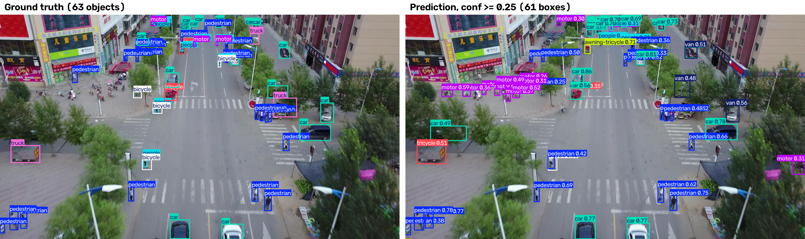
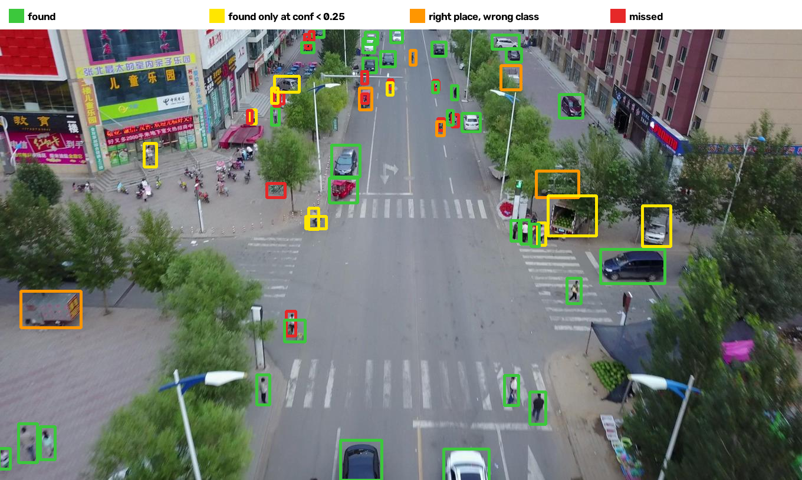

# Aerial detection on the edge

Train YOLO26n on [VisDrone2019-DET](https://github.com/VisDrone/VisDrone-Dataset), export to ONNX,
and compare **FP32 / FP16 / INT8** on accuracy (mAP) and latency with ONNX Runtime
(and TensorRT where a GPU is available).

## Pipeline

| Step | Where | Script | Output |
|------|-------|--------|--------|
| 2. Data and EDA | laptop | `scripts/eda.py` | box-size, class, objects-per-image plots |
| 3. Baseline training | Google Colab (GPU) | `scripts/train.py` | `best.pt`, val mAP |
| 4. ONNX export and parity check | laptop | `scripts/export.py` | `best.onnx`, max abs diff, val mAP |
| 5. Latency benchmark | laptop | `scripts/benchmark.py` | p50/p95 ms, size, peak memory |
| 6. Quantization (FP16, INT8 dynamic/static) | laptop | `scripts/quantize.py` | quantized `.onnx` variants |
| 6. mAP per variant | laptop | `scripts/evaluate.py` | val mAP50, mAP50-95 |
| 7. TensorRT (optional) | Colab GPU | `scripts/export.py` | `.engine` rows |

Settings live in `configs/`. All runs use `seed: 0`. Decisions are made on the val split;
test-dev is used once, at the end.

## Setup

```bash
uv venv --python 3.12
uv pip install -e ".[dev]"
```

The laptop install pulls CPU-only torch wheels (see `[tool.uv.sources]` in `pyproject.toml`).
On Colab, keep the preinstalled CUDA torch and install only what training needs:

```bash
pip install ultralytics==8.4.163 mlflow==3.16.1
export PYTHONPATH=$PWD/src   # instead of `pip install -e .`, whose Python pin may not match Colab
```

Get the data (~2 GB download, 3.7 GB on disk) and run the EDA:

```bash
.venv/bin/yolo settings datasets_dir=$PWD/datasets
.venv/bin/python scripts/download_data.py
.venv/bin/python scripts/eda.py
```

## Data: what makes VisDrone hard

VisDrone2019-DET: 6,471 train / 548 val / 1,610 test-dev images, 10 classes. The EDA
(`scripts/eda.py`, numbers in [`results/eda_summary.csv`](results/eda_summary.csv)) shows three
problems, and each one drives a later decision.

**1. Objects are tiny.** 60% of boxes are under 32 px (COCO "small") at the original resolution;
after the resize to the 640 px model input this becomes **91%**. Median box side at 640:
pedestrian 7.8 px, car 14 px, bus 21.6 px.
→ Resolution is the main accuracy lever (step 8), and aggressive quantization risks the
fine-grained features that tiny objects depend on.


**2. Classes are imbalanced.** `car` is 42% of all boxes; `awning-tricycle` is 0.9% (45 to 1).
→ Report per-class mAP, not only the mean; rare classes are where INT8 degradation shows first.


**3. Scenes are crowded.** 53 objects per train image and 71 per val image on average (busiest
image: 902), against about 7 in COCO.
→ YOLO26 is NMS-free, so crowding does not add NMS cost as in older YOLOs. The default cap of
`max_det=300` detections per image still truncates 3 of 548 val images (12 of 6,471 train);
keep the same `max_det` for every variant so mAP numbers stay comparable.


## Baseline training (Colab)

Open [`notebooks/train_colab.ipynb`](notebooks/train_colab.ipynb) in Colab (File > Open notebook >
GitHub, or upload it) and run the cells: it clones this repo, installs, downloads the data, and
runs the commands below. Set `REPO_URL` in cell 3 to your repo.

`scripts/train.py` passes `configs/train.yaml` to `YOLO.train()`; any `key=value` argument
overrides the config. On Colab, smoke test first, then the full run (do not train on the laptop:
even the smoke test freezes it):

```bash
python scripts/train.py epochs=1 fraction=0.01
```

On Colab the VM disk disappears on disconnect, so weights go to Google Drive and training can
resume from `last.pt`. MLflow uses a local SQLite DB (SQLite on a Drive mount is unreliable),
and `--backup-mlflow` copies it to Drive at the start of every epoch and once more at the end:

```bash
D=/content/drive/MyDrive/aerial-edge
export MLFLOW_TRACKING_URI=sqlite:////content/mlflow.db
python scripts/train.py project=$D/runs --backup-mlflow /content/mlflow.db $D/mlflow.db

# after a disconnect: restore the DB, then resume
cp $D/mlflow.db /content/mlflow.db
python scripts/train.py --resume $D/runs/yolo26n_640/weights/last.pt \
    --backup-mlflow /content/mlflow.db $D/mlflow.db
```

Without `MLFLOW_TRACKING_URI`, the script logs to `mlflow/mlflow.db` in the repo (git-ignored).
To browse the Colab runs on the laptop, copy `mlflow.db` from Drive into `mlflow/` and run
`mlflow ui --backend-store-uri sqlite:///mlflow/mlflow.db`.

Note: at train time Ultralytics 8.4.163 raises `max_det` to the densest image in the data (902),
so its val mAP is not capped at 300 detections. Later steps must set `max_det` explicitly, to the
same value for every variant.

### Baseline result

YOLO26n, 640 px, 100 epochs, batch 16, on a Tesla T4: 4.6 h (about 2.5 min per epoch). The best
checkpoint (by fitness, 0.1·mAP50 + 0.9·mAP50-95) is from epoch 90.

| Split | P | R | mAP50 | mAP50-95 |
|-------|---|---|-------|----------|
| val (548 images, 38,759 boxes) | 0.462 | 0.354 | **0.342** | **0.187** |

Per class (val):

| Class | Boxes | mAP50 | mAP50-95 |
|-------|------:|------:|---------:|
| car | 14,064 | 0.751 | 0.495 |
| bus | 251 | 0.451 | 0.289 |
| motor | 4,886 | 0.405 | 0.164 |
| pedestrian | 8,844 | 0.374 | 0.155 |
| van | 1,975 | 0.368 | 0.242 |
| truck | 750 | 0.308 | 0.189 |
| people | 5,125 | 0.293 | 0.099 |
| tricycle | 1,045 | 0.232 | 0.124 |
| awning-tricycle | 532 | 0.129 | 0.076 |
| bicycle | 1,287 | 0.106 | 0.040 |

What the run shows:

- **In line with published nano baselines** on VisDrone at 640 (YOLOv8n / YOLO11n: mAP50 about
  0.33-0.35, mAP50-95 about 0.19-0.20).
- **Recall is the weak side** (0.35 against 0.46 precision): the model misses tiny objects more than
  it invents them, as the EDA predicts. The worst classes are the smallest or rarest (bicycle,
  awning-tricycle) and `people`, which is easy to confuse with `pedestrian`.
- **The curve flattens around epoch 60-70.** Val mAP50-95: 0.139 at epoch 10, 0.176 at 40, 0.183
  at 60, 0.187 at 90. About 60 epochs would give nearly the same model in half the time; more
  epochs will not help, resolution and model size are the levers left.
- **Turning mosaic off for the last 10 epochs (`close_mosaic=10`) did not help**: mAP50-95 dipped
  from 0.187 to 0.185-0.186 afterwards. On VisDrone mosaic probably keeps helping to the end, since
  it shows many small objects per batch; `close_mosaic=0` is worth a try in a later run.

### What the model finds and misses

`scripts/predict_example.py` runs `best.pt` on one val image (63 objects) and draws the ground truth
next to the predictions at conf >= 0.25, plus an error map that colours every ground-truth box by
what the model did with it (IoU >= 0.5, the mAP50 matching rule).





| Outcome | Objects |
|---------|--------:|
| found (same class, conf >= 0.25) | 32 |
| found only below conf 0.25 | 10 |
| right place, wrong class | 6 |
| missed | 15 |

- **Most misses are tiny, distant people**: 9 of 10 `people` and 5 of 23 `pedestrian` are missed,
  nearly all at the top of the frame, where a person is 5-10 px tall, about one cell of the finest
  (stride-8) grid.
- **Confusions are between look-alike classes from above**: truck as tricycle or van, bicycle as
  pedestrian (a rider looks like a person).
- **Cars and nearby pedestrians are solid** (car: 18 of 18 found at some confidence).
- **Some "false positives" are real objects**: parked motorbikes on the left sidewalk are detected
  but not labelled (VisDrone marks crowded areas as ignored regions), so mAP counts them as errors.

## ONNX export and parity (step 4)

`scripts/export.py` exports `models/best.pt` to ONNX (opset 17, static 640x640, settings in
`configs/export.yaml`) and checks it against PyTorch; numbers in
[`results/export_parity.csv`](results/export_parity.csv).

- **Raw outputs match**: on 16 val images the max abs difference is 0.011 px on box coordinates and
  8e-6 on class scores (float32 rounding).
- **Val mAP is identical**: mAP50 0.3378, mAP50-95 0.1879 for both, with the same settings (batch 1,
  square input, `max_det=500`, CPU).
- These differ slightly from the Colab numbers (0.342 / 0.187) because an ONNX model with a static
  input runs on square letterboxed images, while training val uses rectangular batches. From here on
  every variant is compared under the square-input settings.
- The export uses YOLO26's one-to-many head with NMS afterwards (Ultralytics' default `nms=None`),
  the same head the training val measured. The NMS-free one-to-one head (`nms=False`) is an option
  for later.
- `best.pt` is 5.4 MB because Ultralytics stores weights in FP16; the ONNX model is 9.8 MB in FP32.

## Latency benchmark (step 5)

`scripts/benchmark.py` times the whole CPU pipeline per image, from the raw val image to final
boxes, in three stages: preprocessing (letterbox to 640), inference, and NMS (conf 0.25, iou 0.7).
The ONNX graph ends before NMS, so inference alone would understate the real cost. Each model runs
in its own process; 4 threads, 20 warmup + 200 timed runs cycling over 20 val images. Numbers in
[`results/benchmark.csv`](results/benchmark.csv).

| Runtime | Pre p50 | Infer p50 | Infer p95 | NMS p50 | **Total p50** | **Total p95** | Peak mem |
|---------|--------:|----------:|----------:|--------:|--------------:|--------------:|---------:|
| PyTorch | 4.1 ms | 79.6 ms | 86.5 ms | 5.1 ms | **89.0 ms** | **98.8 ms** | 87 MB |
| ONNX Runtime | 3.8 ms | 41.0 ms | 47.5 ms | 6.9 ms | **51.8 ms** | **65.2 ms** | 150 MB |

- **ONNX Runtime runs inference about 1.9x faster than PyTorch** on this CPU, at identical mAP
  (step 4); end to end the gain is 1.7x, because preprocessing and NMS do not get faster.
- **NMS is about 13% of the ONNX pipeline** (about 40 boxes per image survive conf 0.25). As
  inference gets faster with quantization, NMS becomes a larger share, which is what makes
  YOLO26's NMS-free head interesting later.
- **Peak memory is higher for ONNX Runtime** (its memory arena pre-allocates buffers), not the
  model weights: both models are under 10 MB on disk.
- **Run-to-run noise is about 10%** on this laptop (turbo boost, background load): repeated runs
  gave 41 to 46 ms ONNX inference. Differences smaller than that are not meaningful.

## Quantization (step 6)

`scripts/quantize.py` turns `best.onnx` into three variants; `scripts/evaluate.py` measures val mAP
per variant and per class ([`results/evaluate.csv`](results/evaluate.csv)), and
`scripts/benchmark.py` times them. Settings in the `calibration` and `quantize` sections of
`configs/export.yaml`.

- **FP16**: weights and activations in float16 (input and output stay float32).
- **INT8 dynamic**: int8 weights; each activation's range is measured at run time, per image.
- **INT8 static**: int8 weights and activations; ranges fixed beforehand by calibration on 300
  random **train** images (never val or test), QDQ format.

| Variant | Size | mAP50-95 | Δ mAP50-95 | Infer p50 | Total p50 |
|---------|-----:|---------:|-----------:|----------:|----------:|
| FP32 | 9.8 MB | 0.188 | | 41.0 ms | 51.8 ms |
| FP16 | 4.9 MB | 0.188 | -0.1% | 48.7 ms | 61.7 ms |
| INT8 dynamic | 2.8 MB | 0.166 | -11.5% | 193.3 ms | 209.3 ms |
| INT8 static | 3.0 MB | 0.174 | -7.4% | 62.6 ms | 73.2 ms |

**Accuracy**

- **FP16 is lossless** (-0.1%) and halves the file.
- **Static INT8 first lost 25%**, far more than the 1-3% usual for YOLO. The cause is overflow:
  this CPU has no VNNI, so ONNX Runtime's int8 kernels use an instruction (VPMADDUBSW) that
  saturates on large values. Large vehicles, with large activations, suffered most (truck
  mAP50-95 0.19 -> 0.09). 7-bit weights (`reduce_range`) avoid the overflow: -25% -> -9%. Keeping
  the six final head convs (box and class outputs) in float32 adds a little: -7.4%. Keeping the
  head in float32 alone did almost nothing (-24%), so the head was not the problem. All runs in
  [`results/quantization_experiments.csv`](results/quantization_experiments.csv).
- **Dynamic INT8 loses 11.5%**, and `reduce_range` makes it worse (-36%), so it keeps full 8-bit
  weights.

**Speed: nothing beats FP32 on this CPU**

- **FP16 is about 20% slower**: the i7-8550U has no float16 arithmetic, so ONNX Runtime converts
  back to float32 around most ops.
- **Dynamic INT8 is 4x slower**: measuring and quantizing the activations of every conv, for every
  image, costs more than the int8 math saves. It is meant for matmul-heavy models (transformers),
  not CNNs.
- **Static INT8 is about 40% slower**: without VNNI, int8 convolutions are not faster than
  ONNX Runtime's well-tuned float32 kernels, and the float SiLU activations between convs add a
  quantize and dequantize step around every conv.

**What this means for the edge.** The result is specific to this laptop CPU. INT8 pays off on
hardware with int8 dot-product instructions or accelerators (Intel VNNI/AMX, ARM dot-product
cores such as Raspberry Pi 5, Jetson with TensorRT, NPUs), and FP16 on GPUs and Jetson. There the
size win (3.3x smaller for static INT8) comes with a speed win too; the 7.4% accuracy cost should
be re-measured on the target, since overflow behaviour depends on the kernels. Per class, static
INT8 loses most on tiny and rare classes (bicycle -16%, people -11%, motor -12%), as the EDA
predicted.

## Results

End-to-end CPU latency per image (Intel i7-8550U, 4 threads, batch 1); mAP on val with square
640 input and `max_det=500`.

| Variant | Runtime | Size (MB) | mAP50 | mAP50-95 | p50 (ms) | p95 (ms) |
|---------|---------|-----------|-------|----------|----------|----------|
| FP32 | PyTorch | 5.4 | 0.338 | 0.188 | 89.0 | 98.8 |
| FP32 | ONNX Runtime | 9.8 | 0.338 | 0.188 | **51.8** | **65.2** |
| FP16 | ONNX Runtime | 4.9 | 0.338 | 0.188 | 61.7 | 89.6 |
| INT8 dynamic | ONNX Runtime | 2.8 | 0.311 | 0.166 | 209.3 | 233.9 |
| INT8 static | ONNX Runtime | 3.0 | 0.320 | 0.174 | 73.2 | 85.7 |

On this CPU the FP32 ONNX model is the best choice: quantization shrinks the file but makes
nothing faster, and INT8 costs accuracy. See step 6 for why, and what would change on other
hardware.

## Hardware

| Role | Device |
|------|--------|
| Training | NVIDIA Tesla T4, 15 GB (Google Colab) |
| CPU benchmarks | Intel Core i7-8550U (4 cores / 8 threads, AVX2, no VNNI), Linux |

## License

Ultralytics is AGPL-3.0. That is fine for a public portfolio repo; a commercial product would
need an Ultralytics Enterprise license.
