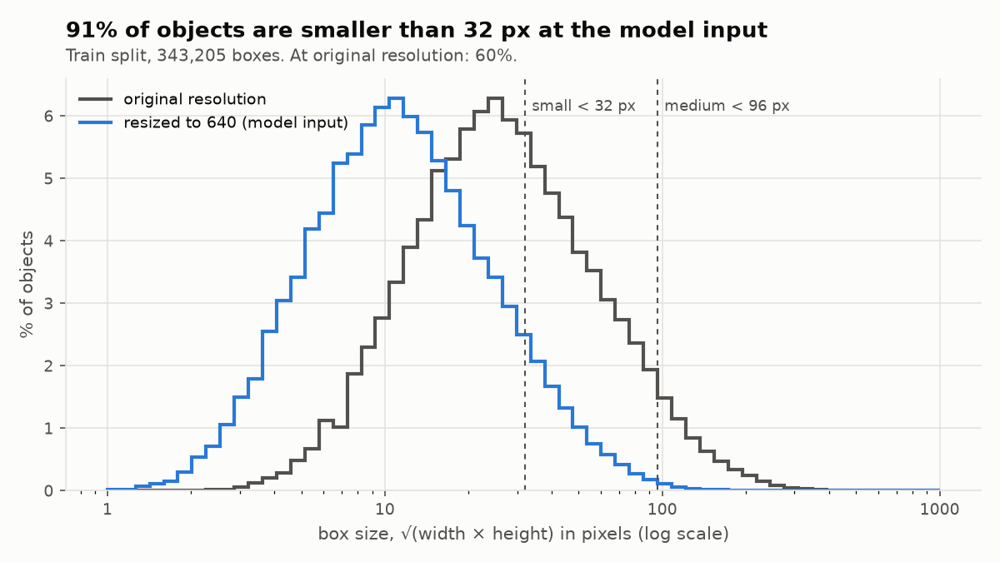
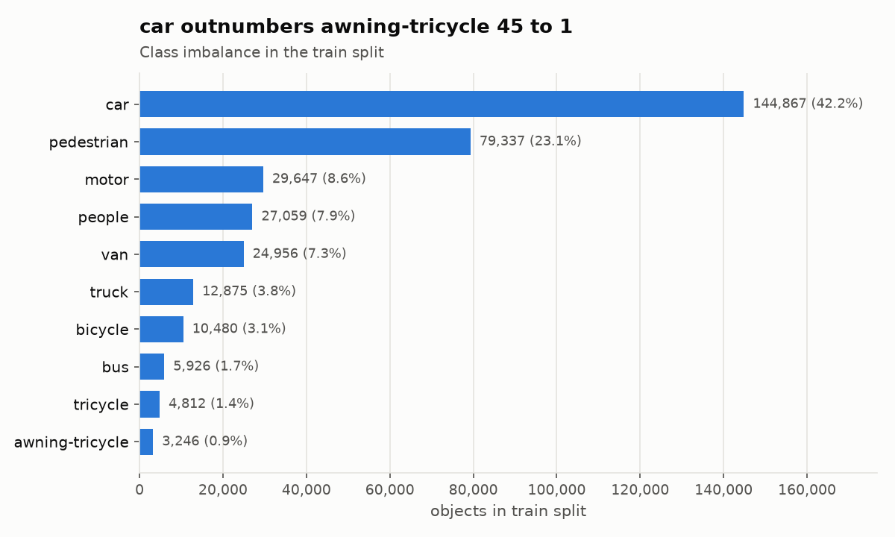
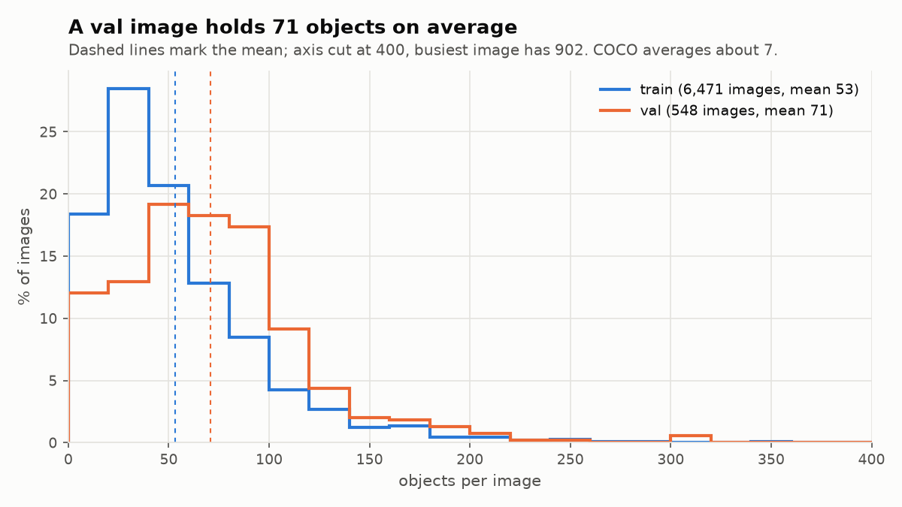

# Aerial detection on the edge

Train YOLO26n on [VisDrone2019-DET](https://github.com/VisDrone/VisDrone-Dataset), export to ONNX,
and compare **FP32 / FP16 / INT8** on accuracy (mAP) and latency with ONNX Runtime
(and TensorRT where a GPU is available).

## Pipeline

| Step | Where | Script | Output |
|------|-------|--------|--------|
| 2. Data and EDA | laptop | `scripts/eda.py` | box-size, class, objects-per-image plots |
| 3. Baseline training | Google Colab (GPU) | `scripts/train.py` | `best.pt`, val mAP |
| 4. ONNX export and parity check | laptop | `scripts/export.py` | `best.onnx`, max abs diff, val mAP |
| 5. Latency benchmark | laptop | `scripts/benchmark.py` | p50/p95 ms, size, peak memory |
| 6. Quantization (FP16, INT8 dynamic/static) | laptop | `scripts/quantize.py` | quantized `.onnx` variants |
| 6. mAP per variant | laptop | `scripts/evaluate.py` | val mAP50, mAP50-95 |
| 7. TensorRT (optional) | Colab GPU | `scripts/export.py` | `.engine` rows |

Settings live in `configs/`. All runs use `seed: 0`. Decisions are made on the val split;
test-dev is used once, at the end.

## Setup

```bash
uv venv --python 3.12
uv pip install -e ".[dev]"
```

The laptop install pulls CPU-only torch wheels (see `[tool.uv.sources]` in `pyproject.toml`).
On Colab, keep the preinstalled CUDA torch and install only what training needs:

```bash
pip install ultralytics==8.4.163 mlflow==3.16.1
export PYTHONPATH=$PWD/src   # instead of `pip install -e .`, whose Python pin may not match Colab
```

Get the data (~2 GB download, 3.7 GB on disk) and run the EDA:

```bash
.venv/bin/yolo settings datasets_dir=$PWD/datasets
.venv/bin/python scripts/download_data.py
.venv/bin/python scripts/eda.py
```

## Data: what makes VisDrone hard

VisDrone2019-DET: 6,471 train / 548 val / 1,610 test-dev images, 10 classes. The EDA
(`scripts/eda.py`, numbers in [`results/eda_summary.csv`](results/eda_summary.csv)) shows three
problems, and each one drives a later decision.

**1. Objects are tiny.** 60% of boxes are under 32 px (COCO "small") at the original resolution;
after the resize to the 640 px model input this becomes **91%**. Median box side at 640:
pedestrian 7.8 px, car 14 px, bus 21.6 px.
→ Resolution is the main accuracy lever (step 8), and aggressive quantization risks the
fine-grained features that tiny objects depend on.



**2. Classes are imbalanced.** `car` is 42% of all boxes; `awning-tricycle` is 0.9% (45 to 1).
→ Report per-class mAP, not only the mean; rare classes are where INT8 degradation shows first.



**3. Scenes are crowded.** 53 objects per train image and 71 per val image on average (busiest
image: 902), against about 7 in COCO.
→ YOLO26 is NMS-free, so crowding does not add NMS cost as in older YOLOs. The default cap of
`max_det=300` detections per image still truncates 3 of 548 val images (12 of 6,471 train);
keep the same `max_det` for every variant so mAP numbers stay comparable.



## Baseline training (Colab)

Open [`notebooks/train_colab.ipynb`](notebooks/train_colab.ipynb) in Colab (File > Open notebook >
GitHub, or upload it) and run the cells: it clones this repo, installs, downloads the data, and
runs the commands below. Set `REPO_URL` in cell 3 to your repo.

`scripts/train.py` passes `configs/train.yaml` to `YOLO.train()`; any `key=value` argument
overrides the config. On Colab, smoke test first, then the full run (do not train on the laptop:
even the smoke test freezes it):

```bash
python scripts/train.py epochs=1 fraction=0.01
```

On Colab the VM disk disappears on disconnect, so weights go to Google Drive and training can
resume from `last.pt`. MLflow uses a local SQLite DB (SQLite on a Drive mount is unreliable),
and `--backup-mlflow` copies it to Drive at the start of every epoch and once more at the end:

```bash
D=/content/drive/MyDrive/aerial-edge
export MLFLOW_TRACKING_URI=sqlite:////content/mlflow.db
python scripts/train.py project=$D/runs --backup-mlflow /content/mlflow.db $D/mlflow.db

# after a disconnect: restore the DB, then resume
cp $D/mlflow.db /content/mlflow.db
python scripts/train.py --resume $D/runs/yolo26n_640/weights/last.pt \
    --backup-mlflow /content/mlflow.db $D/mlflow.db
```

Without `MLFLOW_TRACKING_URI`, the script logs to `mlflow/mlflow.db` in the repo (git-ignored).
To browse the Colab runs on the laptop, copy `mlflow.db` from Drive into `mlflow/` and run
`mlflow ui --backend-store-uri sqlite:///mlflow/mlflow.db`.

Note: at train time Ultralytics 8.4.163 raises `max_det` to the densest image in the data (902),
so its val mAP is not capped at 300 detections. Later steps must set `max_det` explicitly, to the
same value for every variant.

## Results

_TBD._

| Variant | Runtime | Size (MB) | mAP50 | mAP50-95 | p50 (ms) | p95 (ms) |
|---------|---------|-----------|-------|----------|----------|----------|

## Hardware

| Role | Device |
|------|--------|
| Training | _TBD (Colab GPU)_ |
| CPU benchmarks | Intel Core i7-8550U (4 cores / 8 threads, AVX2, no VNNI), Linux |

## License

Ultralytics is AGPL-3.0. That is fine for a public portfolio repo; a commercial product would
need an Ultralytics Enterprise license.
